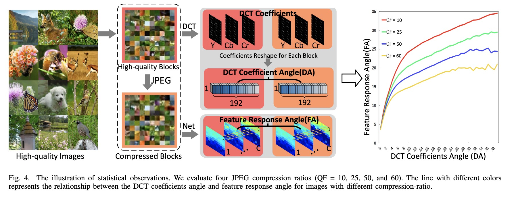

# Lightweight-Adaptive-Feature-De-drifting-for-Compressed-Image-Classification 

[](https://arxiv.org/abs/2401.01724)  [](https://arxiv.org/pdf/2411.10798) 


> **Lightweight-Adaptive-Feature-De-drifting-for-Compressed-Image-Classification**<br>
> Long Peng<sup>1</sup>, Yang Cao<sup>1</sup>, Yuejin Sun<sup>1</sup>, Yang Wang<sup>1</sup> <br>
> <sup>1</sup> University of Science and Technology of China

## :bookmark: News!!!
- [x] 2023-12-1 **Accepted by IEEE Transactions on Multimedia.**

## Abstract

JPEG is a widely used compression scheme to efficiently reduce the volume of the transmitted images at the expense of visual perception drop. The artifacts appear among blocks due to the information loss in the compression process, which not only affects the quality of images but also harms the subsequent high-level tasks in terms of feature drifting. High-level vision models trained on high-quality images will suffer performance degradation when dealing with compressed images, especially on mobile devices. In recent years, numerous learning-based JPEG artifact removal methods have been proposed to handle visual artifacts. However, it is not an ideal choice to use these JPEG artifact removal methods as a pre-processing for compressed image classification for the following reasons: 1) These methods are designed for human vision rather than high-level vision models. 2) These methods are not efficient enough to serve as a pre-processing on resource-constrained devices. To address these issues, this paper proposes a novel lightweight adaptive feature de-drifting module (AFD-Module) to boost the performance of pre-trained image classification models when facing compressed images. First, a Feature Drifting Estimation Network (FDE-Net) is devised to generate the spatial-wise Feature Drifting Map (FDM) in the DCT domain. Next, the estimated FDM is transmitted to the Feature Enhancement Network (FE-Net) to generate the mapping relationship between degraded features and corresponding high-quality features. Specially, a simple but effective RepConv block equipped with structural re-parameterization is utilized in FE-Net, which enriches feature representation in the training phase while keeping efficiency in the deployment phase. After training on limited compressed images, the AFD-Module can serve as a “plug-and-play” module for pre-trained classification models to improve their performance on compressed images. Experiments on images compressed once (i.e. ImageNet-C) and multiple times demonstrate that our proposed AFD-Module can comprehensively improve the accuracy of the pre-trained classification models and significantly outperform the existing methods.

## Motivation

In real-world scenarios, JPEG compression often results in a loss of fine details within the pixel space of an image. Moreover, this compression can also lead to significant degradation or damage in the feature space, which negatively impacts the content representation. As a result, many vision tasks that perform well on high-quality, clear images tend to fail or become ineffective under such conditions.

## Model


## Performance


## Feature Enhancement


## Data

We synthesized JPEG images under various scenarios for testing. The dataset includes images with different compression quality factors (QF): **7**, **10**, **15**, **18**, and **25**. A lower QF indicates a higher compression level and lower image quality.

You can download the dataset from the following Google Drive link:

[Google Drive Dataset Link]([your_link_here](https://drive.google.com/drive/folders/1_Z96FMjqNCtATiYEbTFHTuKsQEqj-s4k?usp=drive_link))

### Test on ImageNet

#### Resnet50 Pretrained by Pytorch

To test the Resnet50 model pretrained by Pytorch, run the following command:

```bash
python3 test_resnet50.py
```
**Table R1: Performance of Resnet50 Pretrained by Pytorch on JPEG data ImageNet**

| JPEG-QF             | Top1 Acc $\uparrow$ |
| ------------------ | ---------------- | 
| 7 | 33.124          | 
| 10    | 47.216          | 
| 15    | 57.313         | 
| 18        | 60.404        |
| 25        | 63.721          |
| Without JPEG        | 76.018       |

As the QF decreases, the performance of the model, which was originally 76% in the clear (without JPEG) scenario, drops to 33%. This indicates that JPEG compression has a significant impact on the performance of ResNet50.

## Cite US
Contact email for Long Peng: longp2001@mail.ustc.edu.cn. Please cite us if this work is helpful to you. 
```
@ARTICLE{10400436,
  author={Peng, Long and Cao, Yang and Sun, Yuejin and Wang, Yang},
  journal={IEEE Transactions on Multimedia}, 
  title={Lightweight Adaptive Feature De-Drifting for Compressed Image Classification}, 
  year={2024},
  volume={26},
  number={},
  pages={6424-6436},
  keywords={Image coding;Transform coding;Discrete cosine transforms;Feature extraction;Performance evaluation;Mobile handsets;Image recognition;Feature drifting;feature enhancement;image classification;JPEG compression},
  doi={10.1109/TMM.2024.3350917}}
```
